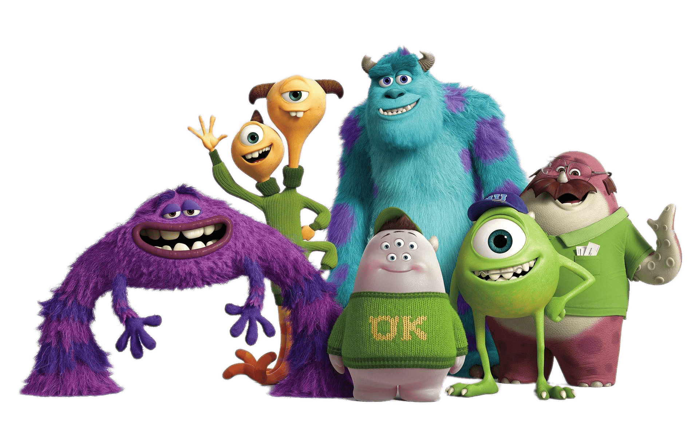

# My First Game Project
# "Picka-Boo!" 

[Play Game](https://virgoeun.github.io/picka-boo/)

## Description

 
 
 
It's inpsired the Pixar's animatino movie, **"Monster.,Inc"**, which is one of my favorite animation. The little girl, named "Boo" accidentally entered into the Monster World, where monsters gather and use children's cries as a energy source. However, a human being cannot entered into the Monster world, because they believe touching human can contaminate them and even kill them, which is a myth. The game starts from there, and **you(user) need to resuce "Boo" in 1 minute!** 

 

I wanted to create a simple, yet colorful game, like you watch an animation, which anyone from 5 year-old girl to 30-year-old man can play. This game will bring you to your inner-child world! 

 

### ▶︎ Instruction 
Each user has 1 minute time and 5 chances to miss, and if you get "Boo"(on click), you get +1 socre and you can keep playing until time is up or you miss all 5 chances.

 

## Main Functionality
1. Load the Start screen
2. **'Find Boo'** image button to start the game.
3. **'How To Play'** image button for **instructions**, which has a click & pops up & close function.
4.**music icon (on/off)** that users can control music sound.
5. Load the game screen.
6. Load the 3*3 **Grid**, each item fits into each boxes of.
7. **game panel** counts scores, misses, and time-left.
8. **Scores** earns by triggering "click" the target.
9. **Miss** earns by triggering "click" the obstacles or empty boxes.
10. When the Miss point is over 5, the game stops and shows the **Game Over** screen.
11. **One target** & **5 Obstalce**: each item pops up without overlaps one time.
12. When **1 minute** is up, the game stops - this is for giving a time pressure to make a game more challenging.
13. When 1 minute is up, the game stops and give you game over screen.
14.**Game Over** has **Do It Again** image button, that brings users to the the Start screen to restart the game.
15.**Mobile(max 480px)** & **Table(max 801px)** responsive screen optimization

 

## Backlog
- Adding different end-screen after time is up, such as "Time is up!" instead of 'game over' screen since time is not the main factor of losing logic.
- Adding a differenet level using local storage with different speeds and more obstacles.
- More design & visual elements (e.g., sound to the end screen)

 

## States
1. **Start Screen**: Title, main image, start Button, instruction button, music control 
2. **Game Screen**: game status panel, grid, background image
3. **Game End**: ending image, restart button

 

## Data Structure
### Class: Game (game.js)
- Game Class: Game()
- createGameScreen();
- removeGameScreen();
- createGameOverScreen();
- removeGameOverScreen();
- startGame();
- gameOver();

### Main (main.js)
- new Game()
- getRandom(indexArray) 
- setMole()
- generateObstacle()
- setInterval()
- clearInterval()
- timeCount()
- click event for score & miss points & endGame()

### Window.Onload (scrpt.js)
- Start & Instruction button click event
- startGame();
- restart button click event
- restart game: location.reload()

 

## Technologies Used
- HTML
- CSS
- JavaScript(ES6): OOP & JS Classes
- DOM Manipulation
## Extra Links

- [Notion Link(Project Tracker)](https://www.notion.so/c12110fb8a294a24ba7fcc416b9e224a?v=9095555613884053a91cc3e8b6000fb2&pvs=4)
- [Slides Link](https://docs.google.com/presentation/d/1qnjEPpRRqf5Ppr8rTeAcEVSfLK1KsevOmA9syoTN8lM/edit?usp=sharing)
- [Github repository Link](https://github.com/virgoeun/picka-boo)
- [Deployment Link](https://virgoeun.github.io/picka-boo/)
